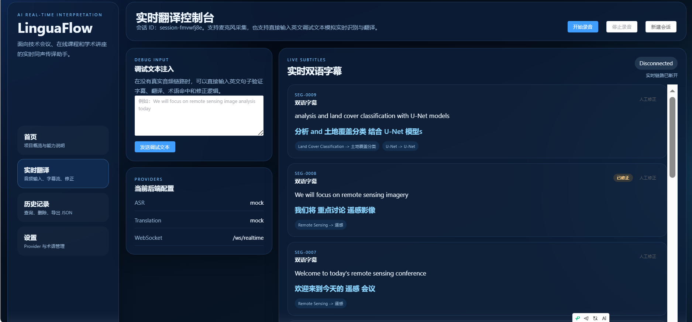

# LinguaFlow

面向技术会议、在线课程、学术讲座、国际会议场景的 AI 实时同声传译助手。

当前版本提供一个可运行的 MVP：
- Vue 3 + Vite + TypeScript + Element Plus + Pinia 前端
- FastAPI + SQLite 后端
- WebSocket 实时双向通信
- mock / OpenAI Whisper / faster-whisper ASR provider 抽象
- mock / OpenAI / Gemini / LibreTranslate 翻译 provider 抽象
- 双语字幕、自动修正、人工修正
- 术语库管理、历史记录查询/删除/导出 JSON

## 运行效果



## 目录结构

```text
LinguaFlow/
├─ frontend/
│  ├─ index.html
│  ├─ package.json
│  ├─ tsconfig.json
│  ├─ vite.config.ts
│  └─ src/
│     ├─ App.vue
│     ├─ main.ts
│     ├─ components/
│     ├─ composables/
│     ├─ pages/
│     ├─ router/
│     ├─ services/
│     ├─ stores/
│     ├─ styles/
│     └─ types/
├─ backend/
│  ├─ requirements.txt
│  ├─ app/
│  │  ├─ api/
│  │  ├─ data/
│  │  ├─ services/
│  │  │  ├─ asr/
│  │  │  └─ translation/
│  │  ├─ ws/
│  │  ├─ config.py
│  │  ├─ database.py
│  │  ├─ main.py
│  │  ├─ models.py
│  │  └─ schemas.py
│  └─ tests/
├─ docs/
│  ├─ architecture.md
│  └─ deployment.md
└─ README.md
```

## 快速开始

### 1. 后端

推荐使用你当前指定的 Python 环境：`D:/ProgramData/miniconda3/envs/py310/python.exe`

安装依赖：

```powershell
"D:/ProgramData/miniconda3/envs/py310/python.exe" -m pip install -r "E:/LinguaFlow/backend/requirements.txt"
```

启动服务（PowerShell 推荐写法）：

```powershell
python -m uvicorn app.main:app --app-dir "E:\LinguaFlow\backend" --host 0.0.0.0 --port 8000
```

如果你使用 bash / Git Bash，也可以这样启动：

```bash
PYTHONPATH="E:/LinguaFlow/backend" "D:/ProgramData/miniconda3/envs/py310/python.exe" -m uvicorn app.main:app --host 0.0.0.0 --port 8000
```

### 2. 前端

安装依赖：

```bash
npm --prefix "E:/LinguaFlow/frontend" install
```

启动开发服务器：

```bash
npm --prefix "E:/LinguaFlow/frontend" run dev
```

前端默认访问 `http://127.0.0.1:8000`。
如需修改，可设置 `VITE_API_BASE_URL`。

## 环境变量

后端支持从 `.env` 读取配置。可参考 [backend/.env.example](backend/.env.example)。

关键项：
- `ASR_PROVIDER=mock|openai|faster-whisper`
- `TRANSLATION_PROVIDER=mock|openai|gemini|libretranslate`
- `OPENAI_API_KEY=`
- `OPENAI_TRANSLATION_MODEL=gpt-4o-mini`
- `OPENAI_WHISPER_MODEL=whisper-1`
- `GEMINI_API_KEY=`
- `LIBRETRANSLATE_URL=`
- `LIBRETRANSLATE_API_KEY=`
- `DATABASE_URL=sqlite:///./linguaflow.db`

## 页面说明

- 首页：项目概览与能力说明
- 实时翻译页：麦克风录音、调试文本注入、双语字幕、自动修正、人工修正、运行时 ASR 切换
- 历史记录页：查询、删除、导出 JSON、继续修正
- 设置页：查看 provider 配置、管理用户术语、运行时切换 ASR / Translation provider

## 运行时切换

当前版本支持在不重启后端的情况下切换 provider。

可切换能力：
- ASR：`mock` / `faster-whisper` / `openai`
- Translation：`mock` / `openai` / `gemini` / `libretranslate`

切换入口：
- 实时翻译页顶部 `ASR Provider`
- 设置页 `运行时配置`

说明：
- 切换后，新的实时会话会按当前 provider 生效
- 当前页面会通过 WebSocket 状态消息同步显示实际运行中的 provider

## 录音与实时行为

当前真实 ASR 模式下的行为是：
- 点击“开始录音”后开始采集音频
- 点击“停止录音”后，后端提交完整语音段进行识别与翻译
- 这样做是为了避免浏览器 `MediaRecorder` 分片在 `faster-whisper` / `openai` 解码时出现 `Invalid data found when processing input`

当前 `mock` 模式下仍可用于演示字幕链路，但不会转写你的真实语音。

## 实时协议

WebSocket 地址：`/ws/realtime`

客户端事件：
- `start`
- `stop`
- `ping`
- `debug_text`
- 二进制音频 chunk

服务端事件：
- `status`
- `asr`
- `translation`
- `correction`
- `error`

## 测试与验证

后端测试：

```bash
PYTHONPATH="E:/LinguaFlow/backend" "D:/ProgramData/miniconda3/envs/py310/python.exe" -m pytest "E:/LinguaFlow/backend/tests"
```

前端构建：

```bash
npm --prefix "E:/LinguaFlow/frontend" run build
```

当前验证结果：
- 后端测试：4/4 通过
- 前端构建：通过
- 运行时 provider 切换接口已验证：`mock -> faster-whisper -> openai -> mock`

## 分阶段交付说明

### Phase 1: 搭建项目结构
- 已完成前后端目录骨架、FastAPI 入口、Vue 脚手架、术语种子和 README 初版。
- 运行命令：见“快速开始”。
- 测试方法：启动前后端并访问 `/api/health` 与前端首页。
- Git Commit Message:

```text
bootstrap runnable LinguaFlow project structure
```

### Phase 2: 实现前端页面
- 已完成首页、实时翻译页、历史记录页、设置页。
- 测试方法：运行前端，逐页检查路由和组件渲染。
- Git Commit Message:

```text
build frontend pages for realtime translation workflow
```

### Phase 3: 实现 FastAPI 服务
- 已完成健康检查、设置、术语、历史记录 REST API。
- 测试方法：运行后端并请求 `/api/settings`、`/api/terms`、`/api/history`。
- Git Commit Message:

```text
add FastAPI REST APIs for settings terms and history
```

### Phase 4: 实现 WebSocket
- 已完成 `/ws/realtime` 实时链路、连接管理与消息协议。
- 测试方法：使用实时翻译页调试文本注入，观察 `status -> asr -> translation -> correction`。
- Git Commit Message:

```text
implement realtime websocket subtitle pipeline
```

### Phase 5: 实现 Whisper 识别
- 已完成 provider 抽象、OpenAI Whisper 接口接入，以及 `faster-whisper` 本地免费识别实现。
- 已支持在前端页面运行时切换 `mock` / `faster-whisper` / `openai`。
- 测试方法：切换 `ASR Provider` 后用麦克风录音验证。
- Git Commit Message:

```text
add configurable ASR providers with OpenAI Whisper support
```

### Phase 6: 实现 AI 翻译
- 已完成 mock / OpenAI / Gemini / LibreTranslate 统一翻译接口。
- 已支持在前端设置页运行时切换翻译 provider。
- 测试方法：切换 Translation Provider 并验证术语优先翻译。
- Git Commit Message:

```text
add translation providers with terminology-aware prompts
```

### Phase 7: 实现字幕系统
- 已完成双语字幕面板、自动修正标记和人工修正弹窗。
- 测试方法：在实时翻译页连续输入上下文相关句子，观察旧字幕自动更新为 `[已修正]`。
- Git Commit Message:

```text
deliver bilingual subtitle UI with correction workflow
```

### Phase 8: 实现历史记录
- 已完成分页查询、删除、按会话删除、JSON 导出和历史片段人工修正。
- 测试方法：在历史页执行检索、删除、导出和修正操作。
- Git Commit Message:

```text
complete subtitle history management and export flow
```

### Phase 9: 生成部署方案
- 已补充部署文档与架构文档。
- 测试方法：按 [docs/deployment.md](docs/deployment.md) 执行本地或容器化部署。
- Git Commit Message:

```text
document deployment and architecture for MVP handoff
```

## 当前限制

- 当前翻译仍然是“整段语音结束后触发 final translation”，还没有做到真正的 partial translation 流式中文草稿。
- 当前真实 ASR 模式下，建议说完一句后点击“停止录音”，由后端对完整音频段做识别；自动断句与更连续的低延迟流式转写还需要继续迭代。
- 公共 `LibreTranslate` 实例稳定性和质量有限，更适合作为免费备用路径，不建议直接作为生产级默认翻译。
- 前端生产构建存在 chunk size 警告，但不影响运行；后续可做路由级拆包优化。
